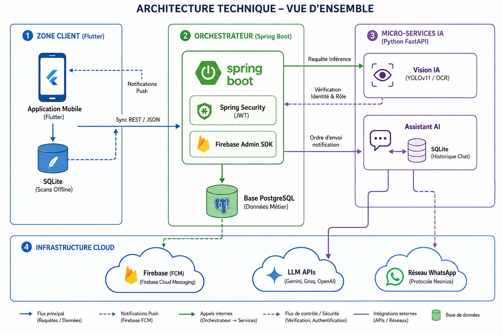
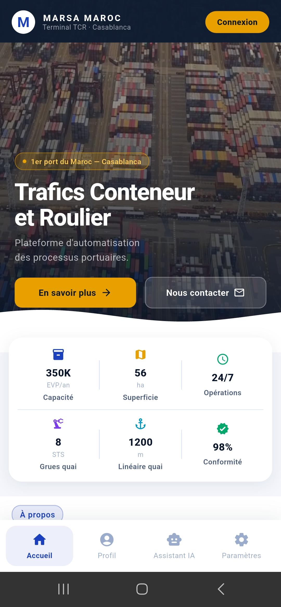
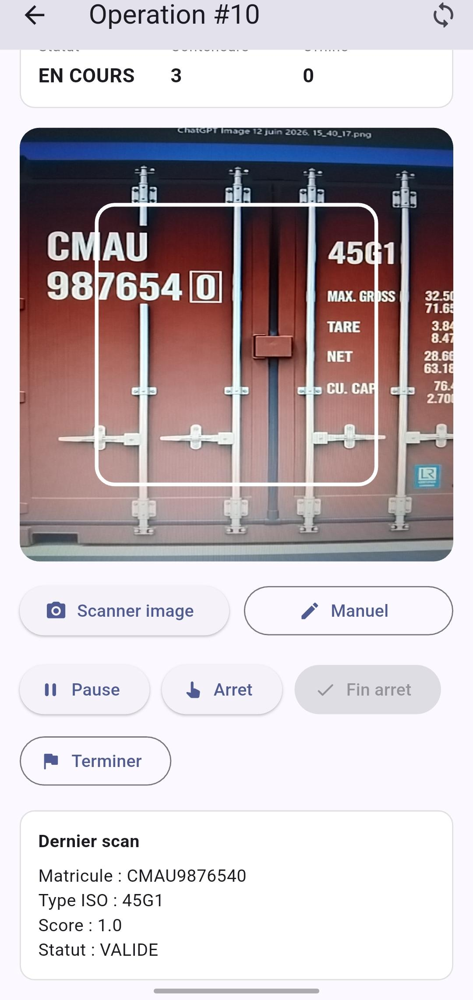
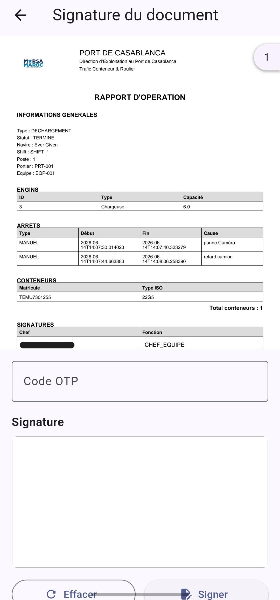
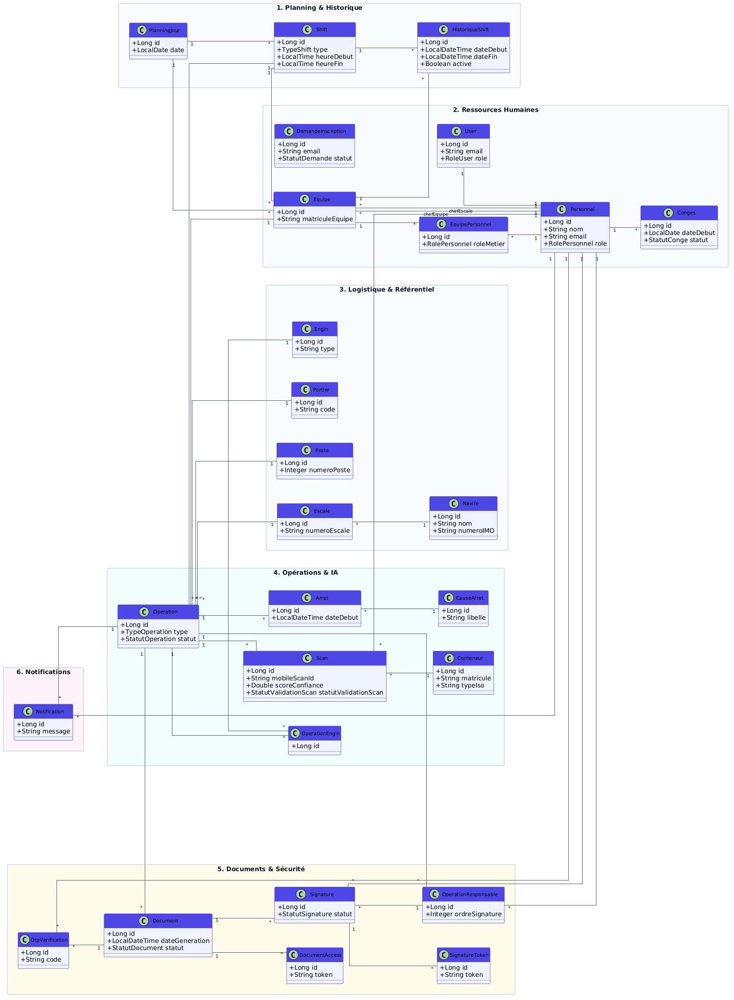
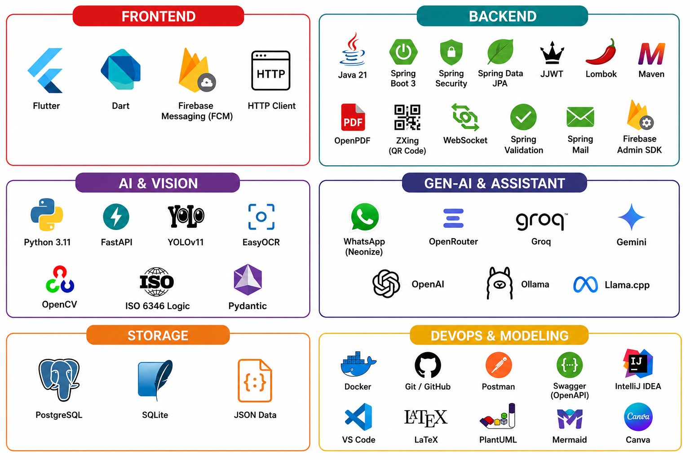
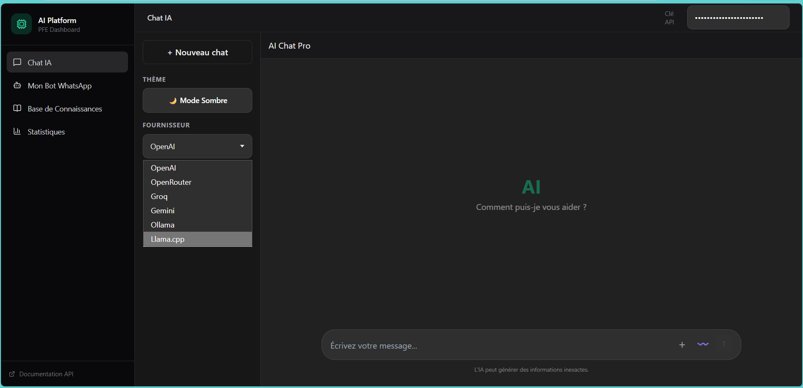
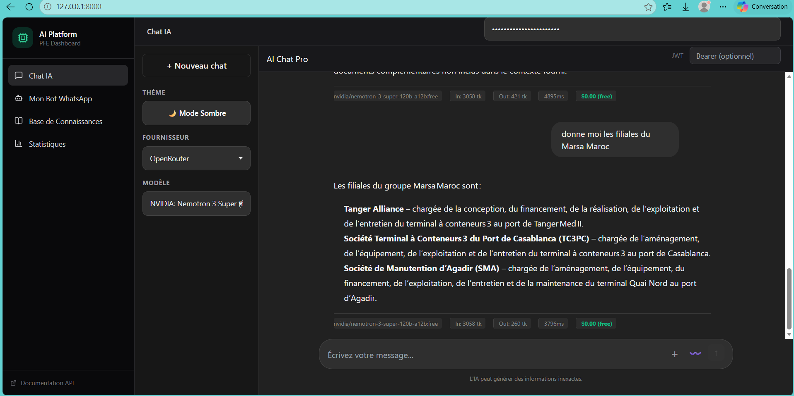
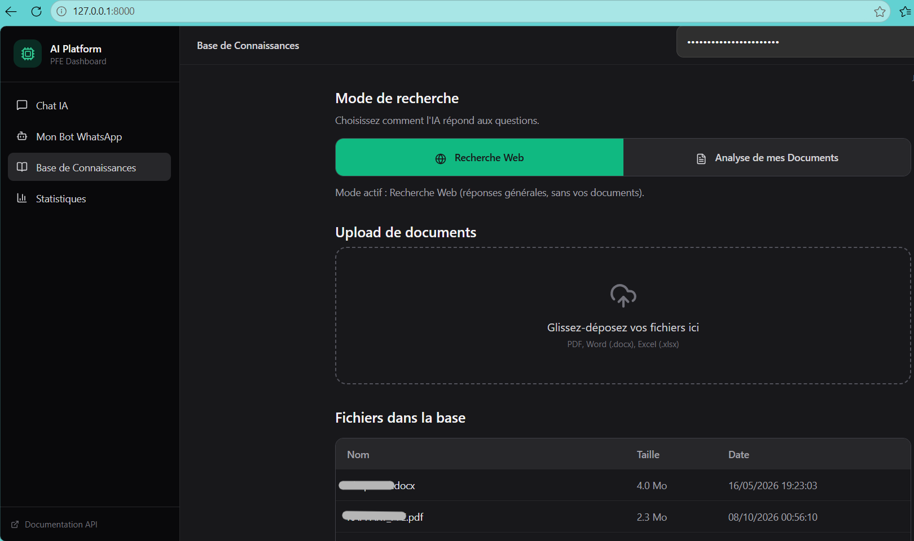
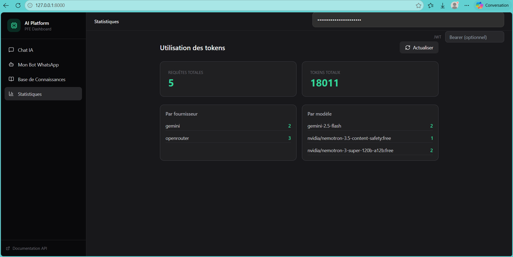

# Application mobile intelligente pour l’automatisation des processus métiers portuaires

**Projet de fin d’études (PFE) — Marsa Maroc, port de Casablanca**

## Présentation du projet

Ce projet de fin d’études porte sur la conception et le développement d’une application mobile intelligente destinée à automatiser et à optimiser certains processus métiers portuaires.

La solution combine une application mobile, une API backend et des microservices spécialisés en intelligence artificielle afin de faciliter les opérations de pointage des conteneurs, la gestion des activités portuaires et la génération de rapports.

Elle intègre notamment la vision par ordinateur pour détecter les matricules et les codes ISO des conteneurs, un fonctionnement hors ligne avec synchronisation des données, ainsi qu’un assistant conversationnel pour faciliter l’accès aux informations et aux services.

## Objectifs

* Automatiser le pointage et le contrôle des conteneurs.
* Détecter automatiquement les matricules et les types ISO grâce à la vision par ordinateur.
* Centraliser les données et les opérations portuaires.
* Permettre la continuité du travail en l’absence de connexion Internet.
* Générer des rapports numériques et gérer leur circuit de validation et de signature.
* Faciliter la communication grâce aux notifications et à un assistant conversationnel intelligent.
* Améliorer le suivi des opérations et la prise de décision.

## Fonctionnalités principales

### 1. Application mobile

* Interface mobile développée avec Flutter.
* Authentification et gestion des accès selon les rôles.
* Consultation des informations et des opérations.
* Pointage et suivi des conteneurs.
* Enregistrement local des données pour le travail hors ligne.
* Synchronisation avec le serveur lorsque la connexion est rétablie.
* Consultation des tableaux de bord et des rapports.

### 2. Détection intelligente des conteneurs

Un microservice Python dédié à la vision par ordinateur exploite YOLOv11, EasyOCR et OpenCV pour faciliter l’identification des informations visibles sur les conteneurs.

Ses principales fonctions sont :

* Détection des zones contenant le matricule et le code de type ISO.
* Reconnaissance du texte détecté.
* Extraction des informations utiles au pointage.
* Vérification du chiffre de contrôle des numéros de conteneurs selon la norme ISO 6346, lorsque cette vérification est applicable.
* Transmission des résultats au backend pour leur exploitation.

### 3. Gestion des opérations portuaires

Le backend centralise les traitements métier et les échanges entre l’application mobile, la base de données et les services spécialisés.

Les fonctionnalités couvrent notamment :

* La gestion des utilisateurs et des rôles.
* Le suivi des conteneurs et des opérations de pointage.
* La gestion des équipes, des services et des opérations.
* La consultation des données et des tableaux de bord.
* La génération de documents et de rapports.
* La gestion des workflows de validation et de signature.

### 4. Rapports et signature

La solution prend en charge la génération de rapports PDF et un processus de gestion de signature. Selon le workflow prévu, les documents peuvent être soumis à une validation et à une confirmation par code OTP.

### 5. Assistant conversationnel et communication

Un service Python distinct fournit des fonctionnalités conversationnelles et de communication :

* Intégration de plusieurs fournisseurs de modèles de langage (LLM).
* Prise en charge de fournisseurs tels qu’OpenAI, Gemini, Groq, OpenRouter et de modèles locaux via Ollama, selon la configuration.
* Intégration de WhatsApp à l’aide de Neonize.
* Conservation de l’historique des conversations dans une base SQLite dédiée.
* Transmission de messages et accès sécurisé à certains documents, selon les autorisations configurées.
* Possibilité d’utiliser Firebase Cloud Messaging pour les notifications mobiles.

## Architecture technique

La solution adopte une architecture orientée microservices. Le backend Spring Boot assure l’orchestration des traitements métier, tandis que les services Python prennent en charge la détection visuelle et les fonctionnalités conversationnelles.

Les échanges entre les composants reposent principalement sur des API REST et le format JSON.

```text
                  ┌─────────────────────────┐
                  │  Application mobile     │
                  │  Flutter / Dart         │
                  └────────────┬────────────┘
                               │ HTTPS / REST
                               ▼
                  ┌─────────────────────────┐
                  │ Backend central         │
                  │ Spring Boot / Java 21   │
                  │ Sécurité et logique     │
                  │ métier                  │
                  └──────┬──────────┬───────┘
                         │          │
              ┌──────────┘          └──────────┐
              ▼                                ▼
  ┌──────────────────────┐        ┌──────────────────────┐
  │ Base PostgreSQL      │        │ Microservice IA      │
  │ Données centrales    │        │ FastAPI              │
  └──────────────────────┘        │ YOLOv11 / EasyOCR    │
                                  │ OpenCV               │
                                  └──────────────────────┘
                                              
                  ┌─────────────────────────┐
                  │ Service conversationnel │
                  │ FastAPI / LLM / WhatsApp│
                  │ Historique SQLite       │
                  └─────────────────────────┘
```

**Gestion des données :**

* **PostgreSQL :** stockage central des données métier.
* **SQLite :** stockage local des données nécessaires au fonctionnement hors ligne et stockage séparé de l’historique conversationnel.
* **Firebase Cloud Messaging :** infrastructure de notifications push.
* **Services Python :** traitement spécialisé de la détection visuelle et de la communication conversationnelle.

*Le schéma représente une vue logique simplifiée de l’architecture. Les détails de déploiement et les flux exacts peuvent varier selon la configuration.*

## Technologies utilisées

| Domaine                       | Technologies                                 |
| ----------------------------- | -------------------------------------------- |
| Application mobile            | Flutter, Dart                                |
| Stockage mobile et hors ligne | SQLite                                       |
| Backend                       | Java 21, Spring Boot 3                       |
| API et sécurité               | REST, JSON, Spring Security, JWT, JJWT       |
| Accès aux données             | Spring Data JPA, JDBC                        |
| Base de données centrale      | PostgreSQL                                   |
| Vision par ordinateur         | Python 3.11, FastAPI, YOLOv11, OpenCV        |
| Reconnaissance de texte       | EasyOCR                                      |
| Validation des données Python | Pydantic                                     |
| Assistant conversationnel     | OpenAI, Gemini, Groq, OpenRouter, Ollama     |
| Communication                 | Neonize, WhatsApp                            |
| Notifications mobiles         | Firebase Cloud Messaging, Firebase Admin SDK |
| Génération de documents       | OpenPDF                                      |
| Codes-barres et QR codes      | ZXing                                        |
| Gestion du backend            | Maven                                        |

Les fournisseurs de modèles d’IA et les services externes dépendent de la configuration et des clés d’accès disponibles.

## Modèle de détection : données et évaluation

Le modèle de détection a été entraîné à partir d’un jeu de données constitué avec Roboflow.

### Préparation des données

| Élément                       | Valeur                                                                                                |
| ----------------------------- | ----------------------------------------------------------------------------------------------------- |
| Nombre total d’images         | 1 000                                                                                                 |
| Images d’entraînement         | 702                                                                                                   |
| Images de validation          | 100                                                                                                   |
| Images de test                | 198                                                                                                   |
| Classes détectées             | `matricule`, `type_iso`                                                                               |
| Taille des images             | 640 × 640 pixels                                                                                      |
| Prétraitement et augmentation | Passage en niveaux de gris, retournement horizontal, variations de luminosité et ajout léger de bruit |

### Résultats d’évaluation

| Métrique                | Résultat |
| ----------------------- | -------: |
| Précision (*Precision*) | ≈ 99,8 % |
| Rappel (*Recall*)       | ≈ 99,3 % |
| mAP@50                  | ≈ 99,6 % |
| mAP@50–95               | ≈ 77,8 % |

**Interprétation des métriques :**

* **Précision :** mesure la proportion de détections positives qui sont correctes.
* **Rappel :** mesure la proportion des objets pertinents effectivement détectés.
* **mAP@50 :** mesure la précision moyenne avec un seuil d’intersection sur union (IoU) de 0,50.
* **mAP@50–95 :** calcule la moyenne de la précision moyenne sur plusieurs seuils IoU, de 0,50 à 0,95.

Ces résultats indiquent de bonnes performances de détection dans les conditions de l’évaluation réalisée. La baisse entre mAP@50 et mAP@50–95 montre notamment que la localisation précise des objets reste un aspect important à considérer.

**Important :** les valeurs ci-dessus sont les résultats communiqués pour le modèle. Le jeu de données utilisé pour calculer ces métriques (entraînement, validation ou test) doit être précisé à partir du rapport d’évaluation original. Il ne faut pas présenter ces valeurs comme des résultats sur le jeu de test sans l’avoir confirmé.

## Structure du projet

```text
PFE/
├── frontend/                  # Application mobile Flutter
├── backend/                   # API REST Spring Boot
├── Detection_AI - Conteneur/  # Microservice de détection
├── Service_Chat_Boot/         # Service conversationnel et communication
├── screenshots/               # Captures d’écran du projet
└── README.md
```

## Captures d’écran

Les captures suivantes permettront d’illustrer les différentes parties de l’application. Remplace les chemins d’exemple par les noms exacts des fichiers présents dans le dossier `screenshots/`.

### Architecture globale



### Écran d’accueil



### Détection des conteneurs



### Rapport PDF et emplacement de signature



### Diagramme de classes



### Technologies utilisées



## Plateforme Web Chat AI

Le projet intègre une interface Web dédiée à l’interaction avec les services d’intelligence artificielle. Elle permet de tester les fonctionnalités conversationnelles et de consulter les réponses générées par les modèles configurés.

### Interface de conversation



### Historique des conversations



## Système RAG (Retrieval-Augmented Generation)

Le système RAG permet d’enrichir les réponses d’un modèle de langage en s’appuyant sur des informations issues d’une base documentaire ou d’une source de connaissances, lorsqu’il est intégré et configuré à cet effet.



### Fonctionnalités du RAG

* Exploitation de documents ou de sources de connaissances pour contextualiser les réponses.
* Recherche d’informations pertinentes avant la génération d’une réponse.
* Production de réponses contextualisées à partir des informations récupérées.

*Les fonctionnalités et les technologies précises de cette partie seront détaillées selon l’implémentation réelle du système.*

## Statistiques et suivi des performances

Cette partie présente les indicateurs permettant de suivre l’activité de la plateforme et, selon les métriques effectivement disponibles, d’observer les performances des services d’intelligence artificielle.

### Tableau de bord statistique



Les captures d’écran peuvent notamment illustrer les statistiques d’utilisation, le nombre de requêtes traitées, les temps de réponse, la consommation de tokens ou la répartition des modèles utilisés, si ces indicateurs sont disponibles dans la plateforme.


## Installation et exécution

Le lancement complet nécessite de configurer chaque composant et les services externes utilisés par l’application.

### Prérequis

* Git
* Flutter SDK
* Java Development Kit (JDK) 21
* Maven ou le Maven Wrapper fourni avec le backend
* Python 3.11
* PostgreSQL
* Les dépendances nécessaires à chaque microservice
* Les clés API et variables d’environnement requises par les services activés

### 1. Cloner le dépôt

```bash
git clone https://github.com/Manal-Elagri/PFE-Port-Business-Process-Automation.git
cd PFE-Port-Business-Process-Automation
```

### 2. Configurer et lancer le backend

Configurer la connexion PostgreSQL et les paramètres des services dans la configuration locale du backend. Les identifiants et les clés doivent être fournis par des variables d’environnement ou un fichier local non versionné.

Depuis le dossier `backend/`, lancer :

```bash
./mvnw spring-boot:run
```

Sous Windows :

```powershell
.\mvnw.cmd spring-boot:run
```

### 3. Configurer et lancer le service de détection

Accéder au dossier `Detection_AI - Conteneur/`, créer un environnement Python et installer les dépendances listées dans le fichier `requirements.txt`, s’il est fourni.

```bash
python -m venv .venv
```

Sous Windows :

```powershell
.\.venv\Scripts\Activate.ps1
```

Installer les dépendances :

```bash
pip install -r requirements.txt
```

Lancer le service avec la commande et le point d’entrée prévus dans ce dossier. Le fichier de poids du modèle, par exemple `best.pt`, doit être présent à l’emplacement attendu par le code.

### 4. Configurer et lancer le service conversationnel

Accéder au dossier `Service_Chat_Boot/` :

```bash
python -m venv .venv
```

Sous Windows :

```powershell
.\.venv\Scripts\Activate.ps1
pip install -r requirements.txt
```

Créer un fichier `.env` local et y définir les variables nécessaires, selon les fonctionnalités activées, par exemple :

```dotenv
SERVICE_API_KEY=your_service_key
OPENAI_API_KEY=your_openai_key
OPENROUTER_API_KEY=your_openrouter_key
GROQ_API_KEY=your_groq_key
```

Remplacer les valeurs d’exemple par de véritables clés stockées localement et ne jamais les publier dans GitHub.

Lancer le service si son point d’entrée est `app.main:app` :

```bash
python -m uvicorn app.main:app --reload --host 127.0.0.1 --port 8000
```

Si l’interface Web est configurée sur la route racine, elle sera accessible à l’adresse :

`http://localhost:8000/`

Une exécution avec Docker Compose est également possible si les fichiers Docker fournis sont configurés :

```bash
docker compose up --build
```

### 5. Configurer et lancer l’application mobile

Depuis le dossier `frontend/` :

```bash
flutter pub get
flutter run
```

Configurer l’adresse de l’API backend en fonction de l’environnement d’exécution. Sur un appareil physique, `localhost` désigne l’appareil lui-même et non l’ordinateur qui héberge le backend.

> Les commandes exactes de démarrage des microservices dépendent des fichiers et des points d’entrée présents dans le dépôt. Vérifier leur configuration avant l’exécution.

## Sécurité

La solution utilise une gestion des accès et des mécanismes d’authentification adaptés à ses composants, notamment JWT et les rôles côté backend.

Avant toute publication ou exécution :

* Ne jamais versionner les clés API, mots de passe ou secrets.
* Exclure les fichiers `.env` et les fichiers de configuration contenant des identifiants.
* Ne pas publier les sessions privées WhatsApp, les QR codes d’association ou les données personnelles.
* Ne pas intégrer de données métier confidentielles ou de documents réels dans les captures d’écran.
* Utiliser des clés de démonstration et des données anonymisées dans le dépôt public.
* Vérifier les autorisations avant de partager des liens vers des rapports ou documents.

## Perspectives d’amélioration

* Améliorer la robustesse de la détection dans des conditions d’éclairage et de prise de vue variées.
* Évaluer le modèle sur des données représentatives de situations opérationnelles réelles.
* Renforcer les mécanismes de synchronisation et de résolution des conflits hors ligne.
* Améliorer les tableaux de bord et le suivi des indicateurs opérationnels.
* Étendre les capacités de l’assistant conversationnel tout en préservant la confidentialité des données.

## Auteur

Projet réalisé dans le cadre du projet de fin d’études en ingénierie, consacré à l’intelligence artificielle, au développement mobile et à l’automatisation des processus métiers portuaires.

**Dépôt GitHub :** [PFE-Port-Business-Process-Automation](https://github.com/Manal-Elagri/PFE-Port-Business-Process-Automation)

> ⚠️ **Important :** Le dossier `screenshots/` contient de nombreuses captures d’écran illustrant les différentes interfaces et fonctionnalités du projet, notamment l’application mobile, la plateforme Web Chat AI, le système RAG et les tableaux de bord statistiques. Les images présentées dans ce README ne sont qu’une sélection ; consultez le dossier `screenshots/` pour découvrir les autres captures.
